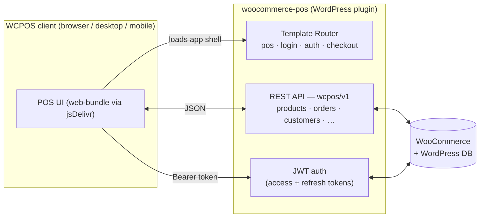

<div align="center">
  <h1>WCPOS — Point of Sale for WooCommerce</h1>
  <p>The WordPress plugin that turns a <a href="https://woocommerce.com">WooCommerce</a> store into a Point of Sale.</p>
  <p>
    <a href="https://github.com/wcpos/woocommerce-pos/actions/workflows/tests-php.yml">
      
    </a>
    <a href="https://wordpress.org/plugins/woocommerce-pos/">
      
    </a>
    <a href="https://wordpress.org/plugins/woocommerce-pos/advanced/">
      
    </a>
    <a href="./LICENSE">
      
    </a>
    <a href="https://wcpos.com/discord">
      
    </a>
  </p>
  <p>
    <a href="#-about"><b>About</b></a>
    &ensp;&mdash;&ensp;
    <a href="#-how-it-works"><b>How it works</b></a>
    &ensp;&mdash;&ensp;
    <a href="#-development"><b>Development</b></a>
    &ensp;&mdash;&ensp;
    <a href="#-testing"><b>Testing</b></a>
    &ensp;&mdash;&ensp;
    <a href="https://wordpress.org/plugins/woocommerce-pos/"><b>Download</b></a>
  </p>
</div>

## 💡 About

**WCPOS** is a simple application for taking orders at the Point of Sale using your WooCommerce store — great for in-person sales and phone orders alike. This repository is the **WordPress plugin**: it provides the WooCommerce/WordPress backend, the REST API, authentication, and the server-rendered templates that the WCPOS client apps run against.

It's free and open source. A live demo is available at **[demo.wcpos.com/pos](https://demo.wcpos.com/pos)** (login `demo` / `demo`).

Free-tier features include:

- **Cross-platform clients** — browser, desktop (Windows/macOS/Linux) and mobile (iOS/Android, in beta).
- **Offline storage** for fast product search and order processing.
- **Flexible cart** — add ad-hoc products that aren't in WooCommerce, scan barcodes into the cart.
- **Receipts** — a gallery of templates (receipts, invoices, quotes, packing slips, gift receipts, kitchen tickets) plus a custom designer.
- **Thermal printing** to 58 mm / 80 mm printers over network, Bluetooth or USB.
- **Customer Tax ID** field (VAT, ABN, GST, etc.) and full multilingual support.

Stock/order/customer management, payment gateways, refunds, coupons, end-of-day reports and multi-store are part of the separate **[WCPOS Pro](https://wcpos.com/pro)** plugin. When Pro is active, this free plugin steps aside, since Pro is a superset.

> **Where's the POS interface?** The client UI is the React Native / Expo app in the [WCPOS monorepo](https://github.com/wcpos/monorepo); its web build is shipped via the [`web-bundle`](https://github.com/wcpos/web-bundle) repo and loaded over the jsDelivr CDN. This repository is the **server side** — the API and templates that serve and authenticate it.

## 🛠 How it works

When a request comes in for the POS, this plugin serves the app shell and exposes a WooCommerce-aware REST API for it to talk to.



- **REST API** — a dedicated `wcpos/v1` namespace (`/wp-json/wcpos/v1/…`) with controllers for products, variations, categories, tags, brands, orders, customers, coupons, taxes, shipping, payment gateways, checkout, receipts, templates, stores, settings, print jobs and more. For requests it doesn't own, it transparently adapts the standard WooCommerce REST API for POS clients.
- **Authentication** — JWT (HS256) with per-site access and refresh secrets. Tokens are read from the `Authorization` header, the Apache `REDIRECT_HTTP_AUTHORIZATION` fallback, or an `?authorization=` query param for hosts that strip auth headers. CORS and frame headers are relaxed on POS routes so the desktop/mobile apps can embed login and load the bundle.
- **Templates** — a custom rewrite router serves the POS app, login, auth and checkout/receipt pages outside the normal WordPress theme. The POS UI bundle itself is loaded from `cdn.jsdelivr.net/gh/wcpos/web-bundle@<ref>/build` (the ref is derived from the plugin version and overridable via the `WCPOS_WEB_BUNDLE_REF` constant/env for local development).
- **Admin** — adds a top-level **POS** menu (View POS, Settings, Templates). The settings, template gallery/editor, analytics and consent screens are small React apps that live in `packages/`.

WooCommerce **HPOS** (custom order tables) and product-instance caching are both supported.

## 📁 Project structure

```
woocommerce-pos.php   # Main plugin file / entry point
readme.txt            # The canonical WordPress.org plugin readme & changelog
includes/             # All plugin PHP (PSR-4: WCPOS\WooCommercePOS\)
  API/                #   wcpos/v1 REST controllers
  Services/           #   Auth (JWT), printing, receipts, tax-ID, integrations
  Templates/          #   Server-rendered POS / login / auth / checkout pages
  Admin/              #   WP-admin menu & settings
templates/            # PHP view templates served to clients
packages/             # pnpm + Turborepo workspace of admin sub-apps (React)
languages/            # i18n (.pot / translations)
vendor_prefixed/      # php-scoped dependencies (e.g. Firebase JWT)
tests/                # PHPUnit + Playwright (UI) + Newman/Postman (API)
```

## ⚙️ Requirements

| | Minimum |
| --- | --- |
| PHP | 7.4 |
| WordPress | 5.6 |
| WooCommerce | 5.3 |

## 👩‍💻 Development

The plugin combines PHP (Composer) with a pnpm/Turborepo workspace for its admin React apps. For a local WordPress install, we recommend [LocalWP](https://localwp.com/) — clone (or symlink) the repo into `wp-content/plugins/` — or use the bundled [`@wordpress/env`](https://developer.wordpress.org/block-editor/reference-guides/packages/packages-env/) Docker environment.

**Prerequisites**

- PHP 7.4+ and [Composer](https://getcomposer.org/)
- [Node.js](https://nodejs.org) and [pnpm](https://pnpm.io) (pinned via `packageManager`)
- [Docker](https://www.docker.com/), if using `wp-env`

**Setup**

```bash
git clone https://github.com/wcpos/woocommerce-pos.git
cd woocommerce-pos

# set the local-development flag
cp .env.example .env

# PHP: scope the bundled JWT/vendor deps, then install
composer prefix-dependencies
composer install

# JS admin apps
pnpm install

# (optional) start a local WordPress with the plugin mounted
pnpm wp-env start
```

**Common commands**

| Command | Description |
| --- | --- |
| `pnpm build` | Build all admin React apps (`pnpm -r run build` via Turborepo) |
| `pnpm settings start` | Run an individual admin app in watch mode (also `template-gallery`, etc.) |
| `composer lint` / `composer format` | PHP_CodeSniffer (WordPress standards) check / autofix |
| `composer fix` | Run PHP-CS-Fixer |
| `composer phpstan` | Static analysis (PHPStan) |
| `pnpm lint:php` | PHPCS with CI-friendly output |
| `pnpm build:docs` | Generate hook documentation (JSDoc / wp-hookdoc) |

A distributable plugin zip is produced by the [`release.yml`](./.github/workflows/release.yml) workflow on a version bump in `woocommerce-pos.php`: it installs prod dependencies, builds the admin apps, prunes dev files via `.distignore`, and attaches the zip to a draft GitHub release. Publishing to WordPress.org SVN is handled by [`wporg-deploy.yml`](./.github/workflows/wporg-deploy.yml).

## 🧪 Testing

| Suite | Tool | Command / CI |
| --- | --- | --- |
| PHP unit | PHPUnit (`wp-env`) | `pnpm test` · [`tests-php.yml`](./.github/workflows/tests-php.yml) |
| JS unit | Jest (Turborepo) | `pnpm test:unit:js` · [`tests-js.yml`](./.github/workflows/tests-js.yml) |
| E2E (UI) | Playwright | [`e2e-ui.yml`](./.github/workflows/e2e-ui.yml) |
| E2E (API) | Postman / Newman | [`e2e-api.yml`](./.github/workflows/e2e-api.yml) |

PHP unit tests run against a matrix of WordPress, WooCommerce and PHP versions; coverage is reported to Codecov.

## 🔗 Links

- 🌐 Website — [wcpos.com](https://wcpos.com)
- 📚 Documentation — [docs.wcpos.com](https://docs.wcpos.com)
- 🧪 Live demo — [demo.wcpos.com/pos](https://demo.wcpos.com/pos) (`demo` / `demo`)
- ⬇️ WordPress.org — [wordpress.org/plugins/woocommerce-pos](https://wordpress.org/plugins/woocommerce-pos/)
- 🧩 Hook reference — [wcpos.github.io/woocommerce-pos](https://wcpos.github.io/woocommerce-pos)
- 📦 Client monorepo — [github.com/wcpos/monorepo](https://github.com/wcpos/monorepo)
- 💬 Discord — [wcpos.com/discord](https://wcpos.com/discord)

## 📄 License

[GPL-3.0+](./LICENSE) © Paul Kilmurray
